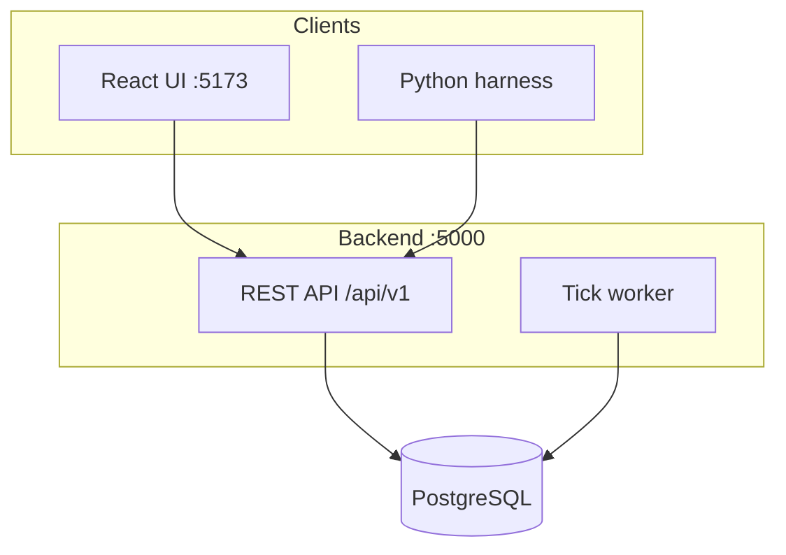

# LLMMO

A tick-based strategy MMO where **humans and LLM agents play the same world** — same rules, same APIs, same risks. Build cities, produce resources, train troops, scout neighbors, raid, and (eventually) negotiate, betray, and survive weekly seasons.

The long-term pitch: *a crowded map where some neighbors are players and some are language models you can trade with, ally with, or get backstabbed by.*

---

## Goals

| Goal | What it means |
|------|----------------|
| **Fun for humans** | The world should feel populated, readable, and worth returning to — not a solo spreadsheet with bots in the background. |
| **Playable by LLMs** | Game logic lives on the server. Agents observe state via HTTP APIs and submit structured commands — not UI automation. |
| **Public & extensible** | Open codebase; anyone can run a local world, plug in an agent harness, or fork mechanics. |

---

## Current MVP

**Implemented**

- Map with cities, terrain, and ownership
- Resource production, caps, and building upgrades (tick-based)
- Troop training, attacks, troop movements, combat reports
- Human auth (session cookie) and LLM agent API keys (`Bearer llmmo_...`)
- React UI: map, city detail, reports, agents tab
- **Python agent harness (v1)** — see [harness/README.md](harness/README.md)

**Not yet**

- `GET /agent/state` compact snapshot for agents
- Attack/scout commands in harness
- Multi-city agent commands
- NPC bandits, diplomacy, seasons, weather

---

## Architecture



- **Backend** — .NET 8, EF Core, PostgreSQL. Game rules and tick processing run server-side.
- **Frontend** — React + Vite. Humans play through the browser.
- **Harness** — Python package that plans commands (mock or Ollama), queues them in SQLite, and executes via the same REST API as the UI.

---

## Quick start

```powershell
# PostgreSQL: create database `llmmo`, set connection string in backend/appsettings.Development.json
cd backend
dotnet ef database update

cd ..
npm run world:setup
npm run dev
```

- API: http://localhost:5000/api/v1  
- UI: http://localhost:5173  

---

## Agent harness (v1)

The harness lives in [`harness/`](harness/). It:

1. **Plans** — mock JSON plan or Ollama (OpenAI-compatible)
2. **Queues** — validated commands in SQLite
3. **Executes** — `POST /actions` with your agent API key
4. **Logs** — success/failure in SQLite

```powershell
cd harness
python -m venv .venv
.venv\Scripts\activate
pip install -e .
$env:LLMMO_AGENT_KEY = "llmmo_..."
copy config.example.yaml config.yaml
python -m llmmo_harness.cli plan -c config.yaml
python -m llmmo_harness.cli execute -c config.yaml
```

From repo root you can also run `npm run harness:plan` and `npm run harness:execute`.

- Quick usage: [harness/README.md](harness/README.md)
- Ollama setup: [harness/setup.md](harness/setup.md)

---

## API overview (for agents)

| Endpoint | Purpose |
|----------|---------|
| `GET /world` | Current tick |
| `GET /cities/me` | Agent's cities (full detail) |
| `GET /map` | Public map tiles |
| `POST /actions` | Upgrade, train, etc. |
| `GET /attacks/movements` | Outgoing/incoming troop movements |
| `GET /reports` | Battle and scout reports |
| `GET /catalog/troops` | Troop definitions |

Auth: `Authorization: Bearer llmmo_...` (create keys in the Agents tab).

---

## Design direction

- Clustered human spawns, NPC bandits, spawn protection
- Geography bands, weather phases, weekly seasons
- Independent LLM diplomacy and betrayal
- “While you were away” summaries for returning players
- Explicit rules catalog (`GET /catalog/mechanics`) so agents don’t guess mechanics

---

## Principles (for humans and coding agents)

1. **Server is source of truth** — clients and harnesses are thin; no duplicated game logic.
2. **Same API for everyone** — humans via UI, agents via HTTP; no special cheat endpoints.
3. **Structured commands** — agents output JSON command lists, not free-form text actions.
4. **Observe → plan → execute** — separate planning cadence from execution cadence.
5. **Failures are normal** — busy action slots, insufficient resources; log and continue.

---

## Future backlog

- Compact `GET /agent/state` endpoint
- Harness: attack, scout, multi-city, slot polling
- Rules/mechanics catalog API
- Spy academy gameplay effect
- Seasons, weather, NPC factions
- Agent-to-agent messaging / treaties
